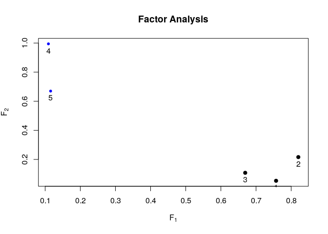

Factor analysis (psych)
================
Jzsyuan
2018年9月22日

-   [loading library](#loading-library)
-   [Describe Data](#describe-data)
-   [Principal Components method](#principal-components-method)
-   [MLE](#mle)
-   [Rotation](#rotation)
-   [Factor score](#factor-score)

loading library
===============

``` r
load.libraries <- c("psych",'knitr','ggplot2','dplyr')
install.lib <- load.libraries[!load.libraries %in% installed.packages()]
for(libs in install.lib) install.packages(libs)
sapply(load.libraries, require, character = TRUE)
```

    ##   psych   knitr ggplot2   dplyr 
    ##    TRUE    TRUE    TRUE    TRUE

``` r
source("/home/jzsyuan/gitground/aftershock/china/tmp/themeofggplot.R")
```

Describe Data
=============

``` r
stock<-read.csv("/home/jzsyuan/Survey-Sampling/FA/STOCK.csv",header=T)
kable(head(stock))
```

|    jpmorgan|    citibank|  wellsfargo|       shell|       exxon|
|-----------:|-----------:|-----------:|-----------:|-----------:|
|   0.0130338|  -0.0078431|  -0.0031889|  -0.0447693|   0.0052151|
|   0.0084862|   0.0166886|  -0.0062100|   0.0119560|   0.0134890|
|  -0.0179153|  -0.0086393|   0.0100360|   0.0000000|  -0.0061428|
|   0.0215589|  -0.0034858|   0.0174353|  -0.0285917|  -0.0069534|
|   0.0108225|   0.0037167|  -0.0101345|   0.0291900|   0.0409751|
|   0.0101713|  -0.0121978|  -0.0083768|   0.0137083|   0.0029895|

``` r
R<-cor(stock) #corrleation Matrix
kable(R)
```

|            |   jpmorgan|   citibank|  wellsfargo|      shell|      exxon|
|------------|----------:|----------:|-----------:|----------:|----------:|
| jpmorgan   |  1.0000000|  0.6322878|   0.5104973|  0.1146019|  0.1544628|
| citibank   |  0.6322878|  1.0000000|   0.5741424|  0.3222921|  0.2126747|
| wellsfargo |  0.5104973|  0.5741424|   1.0000000|  0.1824992|  0.1462067|
| shell      |  0.1146019|  0.3222921|   0.1824992|  1.0000000|  0.6833777|
| exxon      |  0.1544628|  0.2126747|   0.1462067|  0.6833777|  1.0000000|

Principal Components method
===========================

``` r
fit1<-principal(stock,nfactors=2,residuals = TRUE,rotate = "none")
fit1
```

    ## Principal Components Analysis
    ## Call: principal(r = stock, nfactors = 2, residuals = TRUE, rotate = "none")
    ## Standardized loadings (pattern matrix) based upon correlation matrix
    ##             PC1   PC2   h2   u2 com
    ## jpmorgan   0.73 -0.44 0.73 0.27 1.6
    ## citibank   0.83 -0.28 0.77 0.23 1.2
    ## wellsfargo 0.73 -0.37 0.67 0.33 1.5
    ## shell      0.60  0.69 0.85 0.15 2.0
    ## exxon      0.56  0.72 0.83 0.17 1.9
    ## 
    ##                        PC1  PC2
    ## SS loadings           2.44 1.41
    ## Proportion Var        0.49 0.28
    ## Cumulative Var        0.49 0.77
    ## Proportion Explained  0.63 0.37
    ## Cumulative Proportion 0.63 1.00
    ## 
    ## Mean item complexity =  1.6
    ## Test of the hypothesis that 2 components are sufficient.
    ## 
    ## The root mean square of the residuals (RMSR) is  0.1 
    ##  with the empirical chi square  19.17  with prob <  1.2e-05 
    ## 
    ## Fit based upon off diagonal values = 0.95

MLE
===

``` r
fit2<-fa(stock,nfactors = 2,fm = 'ml',residuals = TRUE,rotate = "none")
fit2
```

    ## Factor Analysis using method =  ml
    ## Call: fa(r = stock, nfactors = 2, rotate = "none", residuals = TRUE, 
    ##     fm = "ml")
    ## Standardized loadings (pattern matrix) based upon correlation matrix
    ##             ML1   ML2   h2    u2 com
    ## jpmorgan   0.12  0.75 0.58 0.417 1.1
    ## citibank   0.33  0.79 0.73 0.275 1.3
    ## wellsfargo 0.19  0.65 0.46 0.542 1.2
    ## shell      1.00 -0.01 1.00 0.005 1.0
    ## exxon      0.69  0.03 0.47 0.530 1.0
    ## 
    ##                        ML1  ML2
    ## SS loadings           1.62 1.61
    ## Proportion Var        0.32 0.32
    ## Cumulative Var        0.32 0.65
    ## Proportion Explained  0.50 0.50
    ## Cumulative Proportion 0.50 1.00
    ## 
    ## Mean item complexity =  1.1
    ## Test of the hypothesis that 2 factors are sufficient.
    ## 
    ## The degrees of freedom for the null model are  10  and the objective function was  1.74 with Chi Square of  173.31
    ## The degrees of freedom for the model are 1  and the objective function was  0.02 
    ## 
    ## The root mean square of the residuals (RMSR) is  0.02 
    ## The df corrected root mean square of the residuals is  0.06 
    ## 
    ## The harmonic number of observations is  103 with the empirical chi square  0.78  with prob <  0.38 
    ## The total number of observations was  103  with Likelihood Chi Square =  1.97  with prob <  0.16 
    ## 
    ## Tucker Lewis Index of factoring reliability =  0.939
    ## RMSEA index =  0.102  and the 90 % confidence intervals are  0 0.302
    ## BIC =  -2.66
    ## Fit based upon off diagonal values = 1
    ## Measures of factor score adequacy             
    ##                                                    ML1  ML2
    ## Correlation of (regression) scores with factors   1.00 0.90
    ## Multiple R square of scores with factors          1.00 0.81
    ## Minimum correlation of possible factor scores     0.99 0.63

Rotation
========

``` r
fit3<-principal(stock,nfactors=2,residuals = TRUE,rotate = "varimax")
fit3
```

    ## Principal Components Analysis
    ## Call: principal(r = stock, nfactors = 2, residuals = TRUE, rotate = "varimax")
    ## Standardized loadings (pattern matrix) based upon correlation matrix
    ##             RC1  RC2   h2   u2 com
    ## jpmorgan   0.85 0.04 0.73 0.27 1.0
    ## citibank   0.85 0.22 0.77 0.23 1.1
    ## wellsfargo 0.81 0.08 0.67 0.33 1.0
    ## shell      0.13 0.91 0.85 0.15 1.0
    ## exxon      0.08 0.91 0.83 0.17 1.0
    ## 
    ##                        RC1  RC2
    ## SS loadings           2.13 1.72
    ## Proportion Var        0.43 0.34
    ## Cumulative Var        0.43 0.77
    ## Proportion Explained  0.55 0.45
    ## Cumulative Proportion 0.55 1.00
    ## 
    ## Mean item complexity =  1
    ## Test of the hypothesis that 2 components are sufficient.
    ## 
    ## The root mean square of the residuals (RMSR) is  0.1 
    ##  with the empirical chi square  19.17  with prob <  1.2e-05 
    ## 
    ## Fit based upon off diagonal values = 0.95

``` r
fit4<-fa(stock,nfactors=2,residuals = TRUE,rotate = "varimax")
```

    ## The estimated weights for the factor scores are probably incorrect.  Try a different factor extraction method.

    ## Warning in fac(r = r, nfactors = nfactors, n.obs = n.obs, rotate =
    ## rotate, : An ultra-Heywood case was detected. Examine the results carefully

``` r
fit4
```

    ## Factor Analysis using method =  minres
    ## Call: fa(r = stock, nfactors = 2, rotate = "varimax", residuals = TRUE)
    ## Standardized loadings (pattern matrix) based upon correlation matrix
    ##             MR1  MR2   h2     u2 com
    ## jpmorgan   0.76 0.05 0.58  0.424 1.0
    ## citibank   0.82 0.22 0.72  0.280 1.1
    ## wellsfargo 0.67 0.11 0.46  0.541 1.1
    ## shell      0.11 0.99 1.00 -0.001 1.0
    ## exxon      0.12 0.67 0.46  0.538 1.1
    ## 
    ##                        MR1  MR2
    ## SS loadings           1.72 1.50
    ## Proportion Var        0.34 0.30
    ## Cumulative Var        0.34 0.64
    ## Proportion Explained  0.53 0.47
    ## Cumulative Proportion 0.53 1.00
    ## 
    ## Mean item complexity =  1.1
    ## Test of the hypothesis that 2 factors are sufficient.
    ## 
    ## The degrees of freedom for the null model are  10  and the objective function was  1.74 with Chi Square of  173.31
    ## The degrees of freedom for the model are 1  and the objective function was  0.02 
    ## 
    ## The root mean square of the residuals (RMSR) is  0.02 
    ## The df corrected root mean square of the residuals is  0.05 
    ## 
    ## The harmonic number of observations is  103 with the empirical chi square  0.52  with prob <  0.47 
    ## The total number of observations was  103  with Likelihood Chi Square =  2.21  with prob <  0.14 
    ## 
    ## Tucker Lewis Index of factoring reliability =  0.925
    ## RMSEA index =  0.113  and the 90 % confidence intervals are  0 0.31
    ## BIC =  -2.43
    ## Fit based upon off diagonal values = 1

``` r
plot(fit4,xlab=expression(F[1]),ylab=expression(F[2]))
```



Factor score
============

``` r
facRew=factor.scores(R,fit4$loadings,method="Thurstone") #Regression
facWLSEw=factor.scores(R,fit4$loadings,method="Bartlett") #WLSE
```

``` r
fcRe=as.matrix(stock,103,5)%*%facRew$weight%>%as.data.frame(.)
colnames(fcRe)=c("Bank_Stock","Oil_Stock")
ggplot(fcRe,aes(x=Bank_Stock,y=Oil_Stock))+geom_point(col='blue')+theme_Publication()
```


